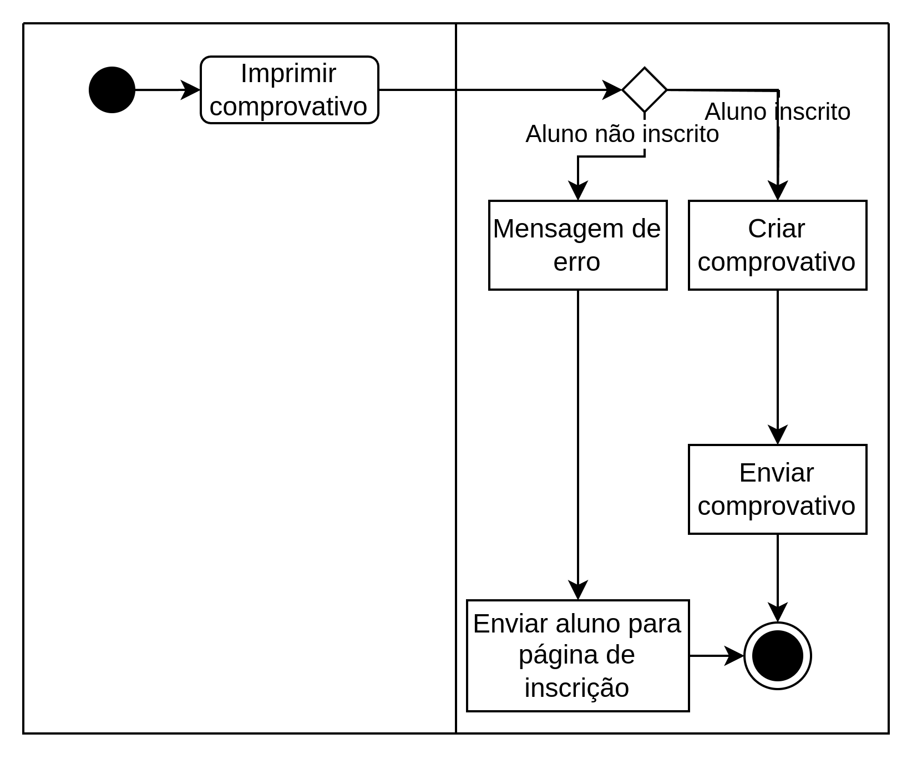
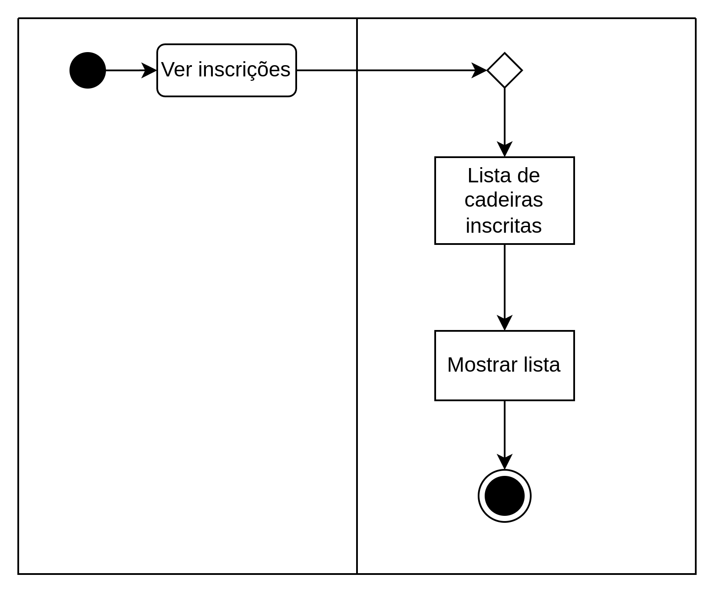
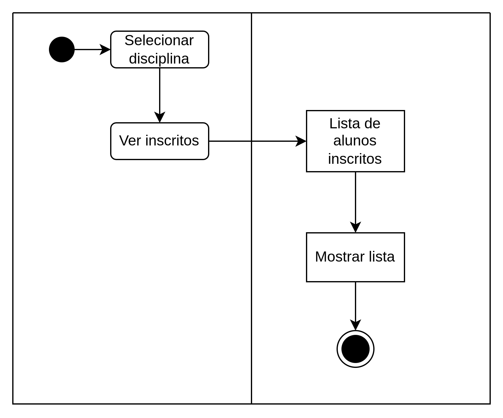
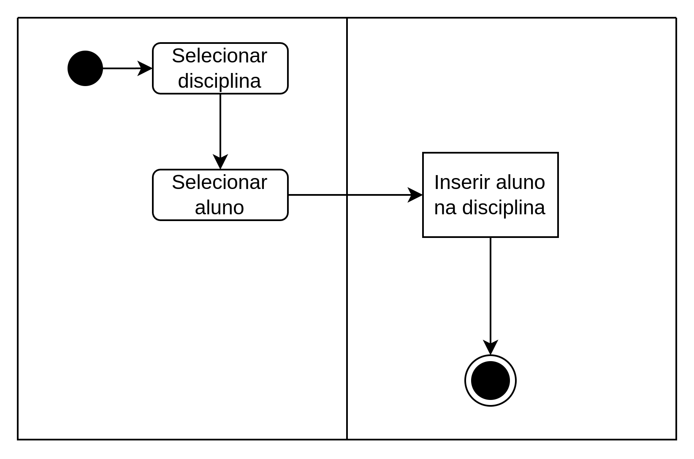

# Exercício 1 - Inscrição ‘online’ de alunos em disciplinas

# Iniciar Sessão

### Descrição detalhada

| Use case                                | Iniciar Sessão                                            |
|-----------------------------------------|-----------------------------------------------------------|
| Descrição   Breve do   Use Case | Permite ao ator iniciar sessão no sistema                 |
| Atores                                  | Aluno, Funcionário Secretaria, Professor, Admin           |
| Outros Interessados                     | -----                                                     |
| Prioridade                              | Alta                                                      |
| Finalidade                              | Ter acesso aos dados da conta   Utilização do sistema |
| Pré- condições                      | O ator deverá ter registo de acesso no sistema            |
| Pós- condições                      | O ator recebe acesso ao sistema                           |
| Trigger                                 | O utilizador tenta entrar no sistema                      |

### Fluxo de Eventos

| Fluxo de Acontecimentos | Ações de Atores                                                 | Sistema                                                                                                                                                         |
|-------------------------|-----------------------------------------------------------------|-----------------------------------------------------------------------------------------------------------------------------------------------------------------|
| Percurso Básico         | 1. Ator tenta iniciar sessão  2. O ator confirma a password |    3. O sistema valida a password.   4. Password é válida, termina o use case.                                                                  |
| Percurso Alternativo    | B1. Utilizador seleciona a opção "Esqueci-me da password"       | A1. O utilizador insere a password incorreta, mensagem de erro é mostrada e o use case reinicia    B2. Email é enviado para o utilizador alterar a password |

### Diagrama de atividades

# Imprimir Comprovativo

### Descrição detalhada

| Use case                                | Imprimir Comprovativo                                                                              |
|-----------------------------------------|----------------------------------------------------------------------------------------------------|
| Descrição   Breve do   Use Case | Imprime o comprovativo de inscrição                                                                |
| Atores                                  | Aluno, Funcionário Secretaria, Professor, Admin                                                    |
| Outros Interessados                     | -----                                                                                              |
| Prioridade                              | Baixa                                                                                              |
| Finalidade                              | Ter um comprovativo da inscrição                                                                   |
| Pré- condições                      | O ator deverá ter a sessão iniciada  O ator deverá estar inscrito em pelo menos uma disciplina |
| Pós- condições                      | O sistema imprime os dados da inscrição                                                            |
| Trigger                                 | O utilizador seleciona a opção "Imprimir Comprovativo"                                             |

### Fluxo de Eventos

| Fluxo de Acontecimentos | Ações de Atores                                          | Sistema                                                                                                                                |
|-------------------------|----------------------------------------------------------|----------------------------------------------------------------------------------------------------------------------------------------|
| Percurso Básico         | 1. O ator seleciona a opção "Imprimir Comprovativo"  |    2. Verifica se aluno está inscrito  3. Sistema cria comprovativo  4. Sistema envia comprovativo por mail        |
| Percurso Alternativo    | -----                                                    | A1. Utilizador não está inscrito em nenhuma cadeira, mensagem de erro aparece  A2. Sistema envia o ator para a página de inscrição |

### Diagrama de atividades

# Consultar Inscrições (do Aluno)

### Descrição detalhada

| Use case                                | Consultar Inscrições (do Aluno)                             |
|-----------------------------------------|-------------------------------------------------------------|
| Descrição   Breve do   Use Case | O aluno consegue consultar as inscrições feitas             |
| Atores                                  | Aluno, Admin                                                |
| Outros Interessados                     | Professor, Funcionário Secretaria                           |
| Prioridade                              | Média                                                       |
| Finalidade                              | O aluno saber as cadeiras as quais conseguiu inscrever-se   |
| Pré- condições                      | O ator tem sessão iniciada   Ser aluno                  |
| Pós- condições                      | O sistema mostra as cadeiras as quais o aluno está inscrito |
| Trigger                                 | O utilizador seleciona a opção "Ver inscrições"             |

### Fluxo de Eventos

| Fluxo de Acontecimentos | Ações de Atores                              | Sistema                                                      |
|-------------------------|----------------------------------------------|--------------------------------------------------------------|
| Percurso Básico         | 1. O ator seleciona a opção "Ver inscrições" |   2. Sistema mostra a lista de disciplinas inscritas |
| Percurso Alternativo    |                                              |                                                              |

### Diagrama de atividades

# Consultar Lista de Inscritos a Disciplina

### Descrição detalhada

| Use case                                | Consultar Lista de Inscritos a Disciplina                        |
|-----------------------------------------|------------------------------------------------------------------|
| Descrição   Breve do   Use Case | Ator consegue ver a lista de alunos numa cadeira                 |
| Atores                                  | Professor, Funcionário Secretaria, Admin                         |
| Outros Interessados                     | Aluno                                                            |
| Prioridade                              | Média                                                            |
| Finalidade                              | Verificar os alunos inscritos na cadeira                         |
| Pré- condições                      | O ator deve ter a sessão iniciada   Ter acesso ao case       |
| Pós- condições                      | Sistema mostra a lista de Alunos inscritos na cadeira            |
| Trigger                                 | O utilizador seleciona a opção "Ver inscritos" dentro da cadeira |

### Fluxo de Eventos

| Fluxo de Acontecimentos | Ações de Atores                                                                   | Sistema                                                                  |
|-------------------------|-----------------------------------------------------------------------------------|--------------------------------------------------------------------------|
| Percurso Básico         | 1. O ator seleciona a disciplina  2. O ator seleciona a opção "Ver inscritos" |    3. O Sistema mostra a lista de alunos inscritos na disciplina |
| Percurso Alternativo    |                                                                                   |                                                                          |

### Diagrama de atividades

# Inscrever Alunos em Disciplinas

### Descrição detalhada

| Use case                                | Inscrever Alunos em Disciplinas                                |
|-----------------------------------------|----------------------------------------------------------------|
| Descrição   Breve do   Use Case | Inscreve vários alunos numa disciplina previamente selecionada |
| Atores                                  | Funcionário Secretaria, Admin                                  |
| Outros Interessados                     | Aluno, Professor                                               |
| Prioridade                              | Alta                                                           |
| Finalidade                              | Inscrever alunos numa disciplina                               |
| Pré- condições                      | Utilizador ter sessão iniciada   Ter acesso ao Use case    |
| Pós- condições                      | Alunos são inscritos na disciplina selecionada                 |
| Trigger                                 | O ator seleciona a opção "Inscrever alunos"                    |

### Fluxo de Eventos

| Fluxo de Acontecimentos | Ações de Atores                                                                                                                                                                                                        | Sistema                                                   |
|-------------------------|------------------------------------------------------------------------------------------------------------------------------------------------------------------------------------------------------------------------|-----------------------------------------------------------|
| Percurso Básico         | 1. Para cada disciplina selecionada  &nbsp;&nbsp; a) O ator seleciona o código da cadeira  &nbsp;&nbsp; 2. Para cada aluno selecionado  &nbsp;&nbsp;&nbsp;&nbsp;&nbsp; a) O ator seleciona o nmec do aluno |     3. O sistema insere o aluno na disciplina |
| Percurso Alternativo    |                                                                                                                                                                                                                        |                                                           |

### Diagrama de atividades

